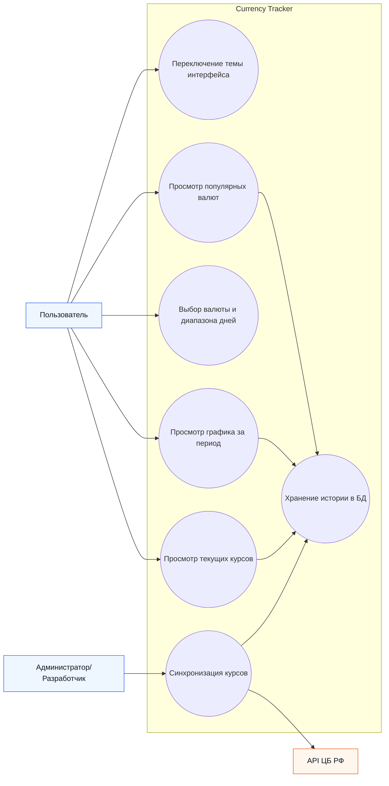
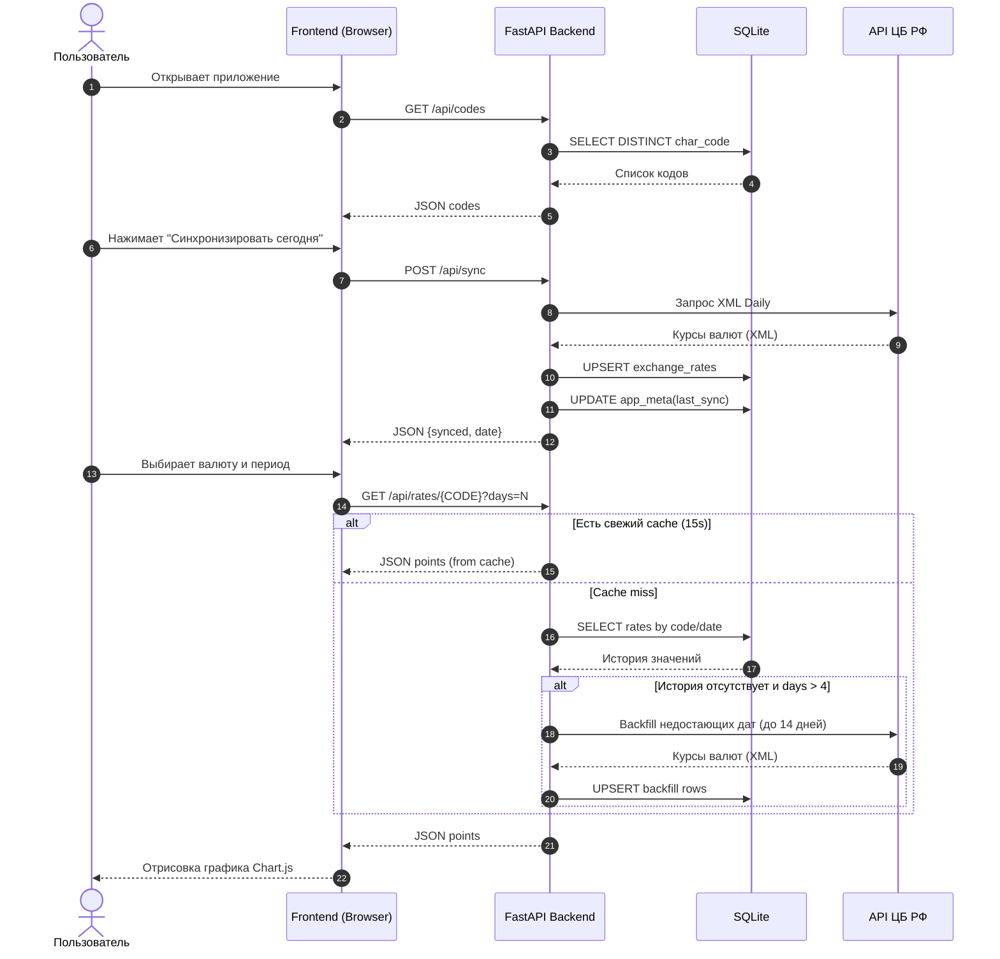
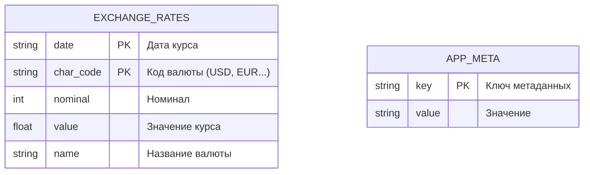

# Currency Tracker

**Тема практики:** Осуществление интеграции программных модулей
**Номер и название темы:** Интеграция валютных данных ЦБ РФ в систему учета.
**Группа:**  9-3 РПО 2023/1

## 1. СОСТАВ КОМАНДЫ

- Павел Якоби (Роль: DevOps/Архитектор, Backend, Frontend) - ответственность: архитектура проекта, серверная логика, интеграция с API ЦБ РФ, работа с базой данных, интерфейс, визуализация и сборка.

## 2. ТЕХНИЧЕСКИЙ СТЕК

- Язык программирования: Python 3.12, JavaScript
- Бэкенд фреймворк: FastAPI
- База данных: SQLite
- Внешние интеграции: API Центрального банка РФ (XML Daily)
- Ключевые библиотеки: requests, APScheduler, Alembic, Pydantic, Chart.js, Tailwind CSS, FlyonUI

## 3. ЛОГИКА РАБОТЫ И ИНТЕГРАЦИИ

Фронтенд запрашивает данные у бэкенда через REST API.  
Бэкенд обращается к API ЦБ РФ, получает и обрабатывает курсы валют, сохраняет их в SQLite.  
Затем подготовленные данные возвращаются на фронтенд для отображения карточек валют, таблиц и графика динамики курса.

Для ускорения интерфейса в API используется краткоживущий in-memory cache:
- `/api/favorites` кэшируется на 30 секунд;
- `/api/rates/{char_code}?days=N` кэшируется на 15 секунд;
- после `POST /api/sync` кэш очищается, чтобы фронтенд получил актуальные данные.

## 4. ИНСТРУКЦИЯ ПО ЗАПУСКУ

Шаг 1: Клонирование репозитория командой:

```powershell
git clone https://github.com/AstraRui/currency-tracker-app.git
cd currency-tracker-app
```

Шаг 2: Установка зависимостей:

```powershell
powershell -ExecutionPolicy ByPass -c "irm https://astral.sh/uv/install.ps1 | iex"
uv sync
npm install
```

Шаг 3: Запуск проекта:

```powershell
npm run build:css
uv run uvicorn app.main:app --reload
```

После запуска откройте в браузере `http://127.0.0.1:8000/`.

## Структура проекта

- `app/main.py` - точка входа приложения (инициализация FastAPI, scheduler, подключение роутов).
- `app/api/routes.py` - HTTP-эндпоинты и обработчики API.
- `app/core/sync_service.py` - бизнес-логика синхронизации и backfill курсов.
- `app/core/config.py` - пути и базовые настройки приложения.
- `app/schema.py` - SQLAlchemy metadata для Alembic.
- `app/database.py` - работа с SQLite (query, upsert, stats, meta).

## 5. ФУНКЦИОНАЛЬНЫЕ ВОЗМОЖНОСТИ

- Получение актуальных курсов валют из API ЦБ РФ и синхронизация в локальную базу.
- Построение графика изменений курса выбранной валюты за заданное количество дней.
- Отображение популярных валют и дневных изменений с удобным интерфейсом.
- Ускоренная выдача данных для графика и блока популярных валют за счет короткого серверного кэша.

## 6. СКРИНШОТ ПРИЛОЖЕНИЯ


## 7. МАТЕРИАЛЫ ДЛЯ ОТЧЕТА

Ниже собраны UML-схемы и ключевые листинги в формате раскрывающихся блоков.

<details>
  <summary><strong>Use Case Diagram</strong> (роли и варианты использования)</summary>



Источник: `docs/uml/use-case.md`
</details>

<details>
  <summary><strong>Sequence Diagram</strong> (процесс обмена данными)</summary>



Источник: `docs/uml/sequence.md`
</details>

<details>
  <summary><strong>Database Schema (ER)</strong></summary>



Источник: `docs/uml/database-schema.md`
</details>

<details>
  <summary><strong>Листинги ключевого кода</strong> (интеграция + синхронизация)</summary>

Полная версия листингов: `docs/code-listings.md`

```python
def fetch_daily_rates(timeout_s: float = 10.0) -> list[CbrRate]:
    resp = requests.get(CBR_DAILY_URL, timeout=timeout_s)
    resp.raise_for_status()
    return _parse_rates_xml(resp.content)
```

```python
def sync_today() -> dict:
    try:
        rates = fetch_daily_rates()
        if not rates:
            raise HTTPException(status_code=502, detail="CBR returned no rates")
        rates_date = rates[0].date
        if has_rates_for_date(DB_PATH, date.fromisoformat(rates_date)):
            touch_last_sync(DB_PATH, ok=True, detail="already in db")
            return {"status": "ok", "synced": False, "date": rates_date, "reason": "already in db"}
        rows = [RateRow(date=r.date, char_code=r.char_code, nominal=r.nominal, value=r.value, name=r.name) for r in rates]
        count = upsert_rates(DB_PATH, rows)
        touch_last_sync(DB_PATH, ok=True, detail=f"rows_upserted={count}")
        return {"status": "ok", "synced": True, "date": rates_date, "rows_upserted": count}
    except HTTPException as exc:
        touch_last_sync(DB_PATH, ok=False, detail=f"HTTP {exc.status_code}: {exc.detail}")
        raise
```

Источник реализации: `app/core/sync_service.py`
</details>