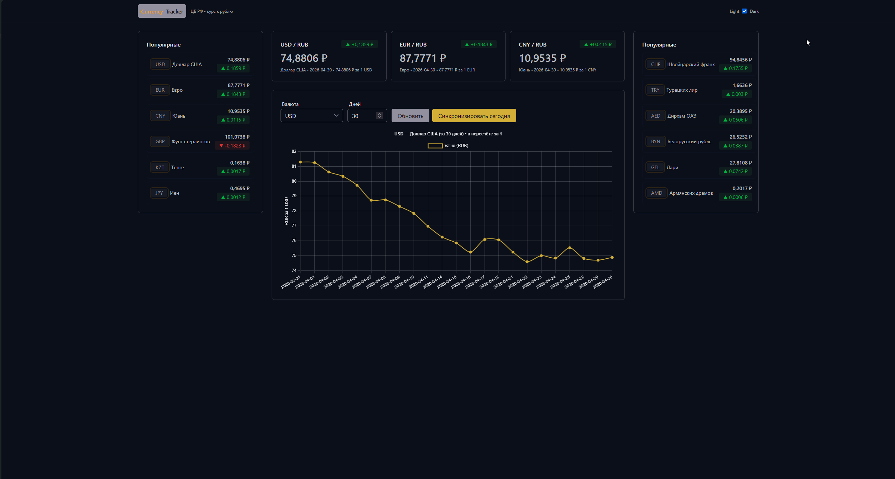

# Currency Tracker

**Тема практики:** Интеграция данных ЦБ РФ в систему учета  
**Номер и название темы:** Интеграция валютных данных ЦБ РФ в систему учета.
**Группа:**  9-3 РПО 2023/1

## 1. СОСТАВ КОМАНДЫ

- Павел Якоби (Роль: DevOps/Архитектор, Backend, Frontend) - ответственность: архитектура проекта, серверная логика, интеграция с API ЦБ РФ, работа с базой данных, интерфейс, визуализация и сборка.

## 2. ТЕХНИЧЕСКИЙ СТЕК

- Язык программирования: Python 3.12, JavaScript
- Бэкенд фреймворк: FastAPI
- База данных: SQLite
- Внешние интеграции: API Центрального банка РФ (XML Daily)
- Ключевые библиотеки: requests, APScheduler, Alembic, Pydantic, Chart.js, Tailwind CSS, FlyonUI

## 3. ЛОГИКА РАБОТЫ И ИНТЕГРАЦИИ

Фронтенд запрашивает данные у бэкенда через REST API.  
Бэкенд обращается к API ЦБ РФ, получает и обрабатывает курсы валют, сохраняет их в SQLite.  
Затем подготовленные данные возвращаются на фронтенд для отображения карточек валют, таблиц и графика динамики курса.

## 4. ИНСТРУКЦИЯ ПО ЗАПУСКУ

Шаг 1: Клонирование репозитория командой:

```powershell
git clone https://github.com/<your-username>/currency-tracker-app.git
cd currency-tracker-app
```

Шаг 2: Установка зависимостей:

```powershell
uv sync
npm install
```

Шаг 3: Запуск проекта:

```powershell
npm run build:css
uv run uvicorn app.main:app --reload
```

После запуска откройте в браузере `http://127.0.0.1:8000/`.

## 4. ФУНКЦИОНАЛЬНЫЕ ВОЗМОЖНОСТИ

- Получение актуальных курсов валют из API ЦБ РФ и синхронизация в локальную базу.
- Построение графика изменений курса выбранной валюты за заданное количество дней.
- Отображение популярных валют и дневных изменений с удобным интерфейсом.

## 5. СКРИНШОТ ПРИЛОЖЕНИЯ

