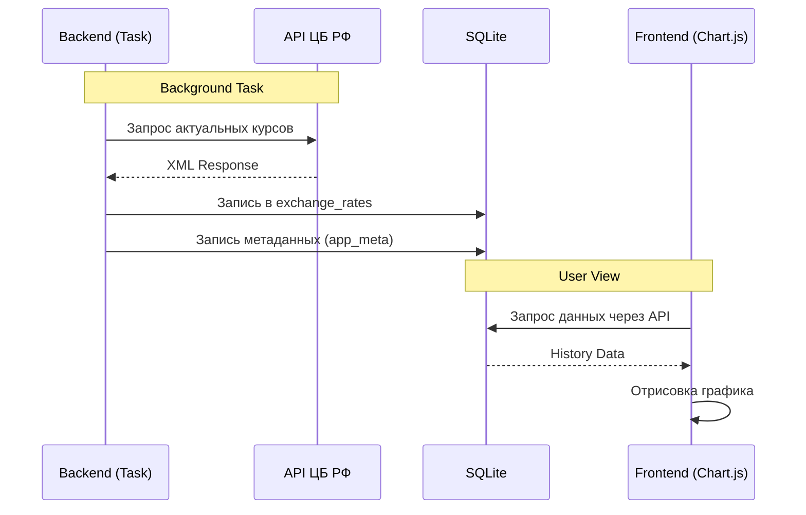

# Currency Tracker Mod

**Интеграция данных ЦБ РФ в систему учета**

Легковесный модуль для автоматического сбора курсов валют и их визуализации. Проект выполнен в рамках учебной практики.
⚡️ Key Features

    Auto-Sync: Ежедневное получение данных через API ЦБ РФ.

    Persistence: Надежное хранение истории в SQLite.

    Analytics: Динамические графики курса на базе Chart.js.

    Quality Control: Код проверен линтером Ruff.

🛠 Tech Stack

    Core: Python 3.12, FastAPI.

    Database: SQLite + Alembic (migrations).

    Integration: requests, APScheduler.

    Frontend: Tailwind CSS, FlyonUI, Chart.js.

📊 Integration Flow

Согласно регламенту, ниже представлена схема взаимодействия компонентов:


🚀 Quick Start
Windows PowerShell (через `uv`)

```powershell
# Установка зависимостей (создаст .venv)
uv sync

# Установка фронтенд-зависимостей (Tailwind + FlyonUI)
npm install

# Сборка CSS в ./static/app.css
npm run build:css

# Запуск dev-сервера
uv run uvicorn app.main:app --reload
```

Откройте в браузере `http://127.0.0.1:8000/`.

Минимальные API:

- `GET /api/codes` — список валютных кодов, которые есть в базе
- `GET /api/stats` — сводка “Сегодня” (последняя дата в БД, количество валют, статус синхронизации)
- `GET /api/favorites` — данные для таблицы “Избранное” (курс, ∆ день, ∆ 7д, спарклайн)
- `GET /api/rates/{CODE}?days=30` — точки для графика
- `POST /api/sync` — синхронизировать курсы “на сегодня”

Миграции:

- Alembic настроен в `alembic.ini`, миграции лежат в `alembic/versions/`.
- Для применения миграций: `uv run alembic upgrade head`