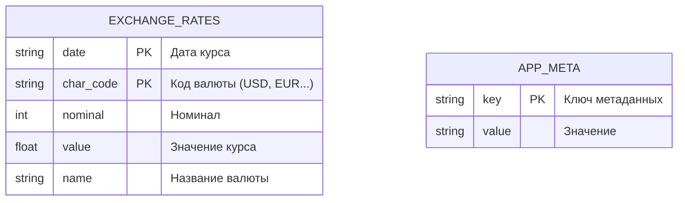

# Database Schema (ER Diagram)

ER-диаграмма показывает структуру базы данных проекта и состав полей в каждой таблице.  
Таблица `EXCHANGE_RATES` хранит историю курсов по датам и валютным кодам, поэтому использует составной первичный ключ.  
Таблица `APP_META` предназначена для служебной информации приложения, например даты последней успешной синхронизации.

## Notes

- Таблица `EXCHANGE_RATES` хранит исторические курсы, первичный ключ составной: `date + char_code`.
- Таблица `APP_META` хранит служебные метаданные (например, дату последней синхронизации).
