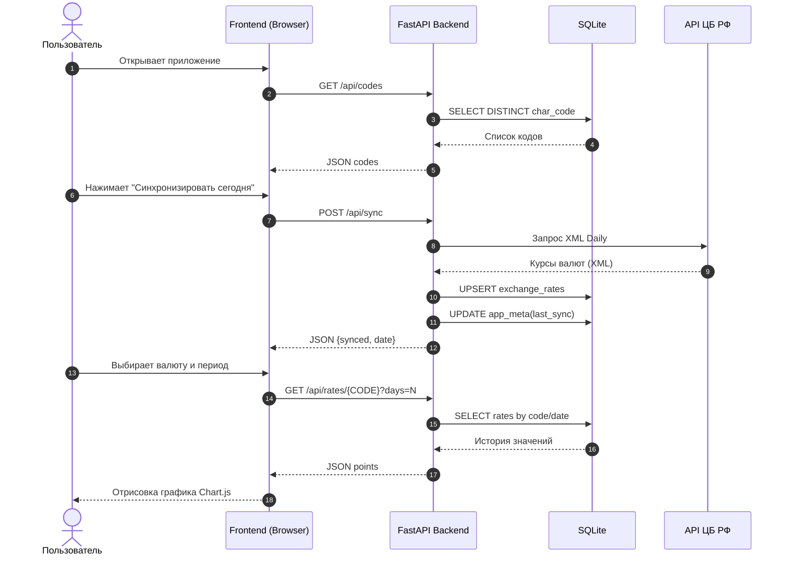

# Sequence Diagram

Диаграмма последовательности описывает полный обмен данными между пользователем, интерфейсом, FastAPI, SQLite и API ЦБ РФ.  
На ней показаны три ключевых потока: первичная загрузка кодов валют, синхронизация актуальных курсов и запрос истории для графика.  
Схема демонстрирует, что фронтенд работает только через API бэкенда, а все операции чтения/записи выполняются на стороне сервера.
