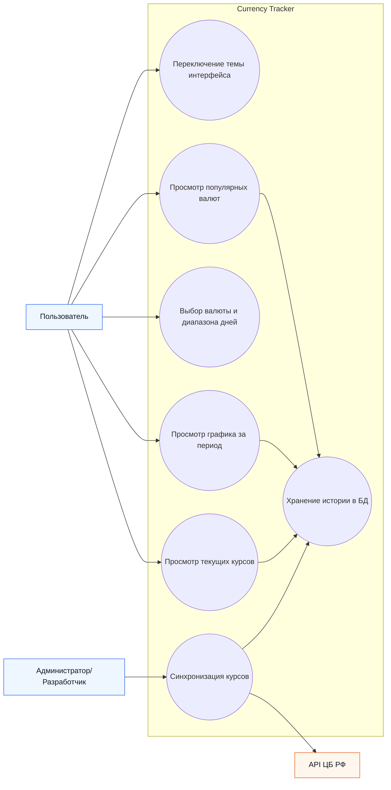

# Use Case Diagram

Диаграмма показывает роли, которые взаимодействуют с системой: пользователь, администратор/разработчик и внешний API ЦБ РФ.  
Для пользователя отражены основные сценарии работы с интерфейсом: просмотр курсов, графика, популярных валют и переключение темы.  
Отдельно выделен сценарий синхронизации, где система получает данные из ЦБ РФ и сохраняет историю курсов в базе данных.
